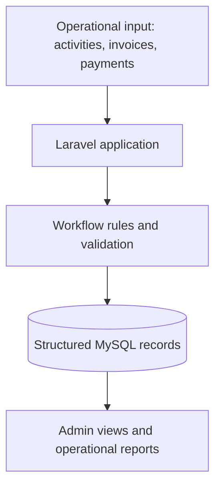

# Industrial Operations Automation System

**Real operational case study · Internal business system · Laravel / PHP / MySQL**

A connected internal system designed to replace fragmented operational and financial tracking with structured workflows, consistent records, and clearer reporting.

> **Evidence boundary:** This repository documents the business problem, requirements, system design, delivery approach, and lessons learned. Source code, client data, database details, credentials, financial records, and sensitive production screenshots are intentionally excluded.

## Executive Summary

Daily operations, sales, purchases, customer and supplier debts, checks, expenses, employees, and financial accounts influence one another. When these activities are managed across disconnected records, it becomes difficult to understand current status, trace changes, reconcile balances, and produce dependable reports.

The solution grew from a practical operational need into a broader Laravel-based internal management system. It was developed in small, testable iterations and refined as real workflows, reporting needs, and operational constraints became clearer.

## Business Problem

The existing workflow created several recurring risks:

- Operational and financial records were not centralized.
- The same information could require repeated manual entry.
- Customer receivables and supplier obligations were difficult to monitor consistently.
- Check status, due dates, and transfers needed a dedicated workflow.
- Financial movements were difficult to trace across disconnected records.
- Reports required manual effort and could not always answer operational questions quickly.
- Missing or inconsistent records could silently affect balances and reporting.

The objective was not merely to digitize forms. It was to create one usable operating structure for connected business activities.

## Requirements

| Area | Operational requirement |
|---|---|
| Daily operations | Record recurring activity and connect it to sales and reporting. |
| Sales and invoices | Manage invoices, line items, payments, and customer balances. |
| Purchases | Track suppliers, purchased items, paid amounts, and remaining balances. |
| Customer debts | Make receivables and payment status visible. |
| Supplier debts | Track obligations and balances by supplier. |
| Checks | Manage received and issued checks, due dates, status, and transfers. |
| Expenses | Record expenses with dates, categories, and reporting filters. |
| Employees | Keep employee identifiers, contact details, and payment records structured. |
| Financial accounts | Track cash, card, bank, and transfer activity in ledger-style records. |
| Reporting | Turn connected records into views that answer real operational questions. |

## System Design

The application uses Laravel and PHP for business logic, MySQL for structured records, and Blade templates for a practical server-rendered administration interface. Docker supports a consistent local development environment, while Git provides versioned delivery and change tracking.

## Connected Modules

The system brings several related areas into one operational boundary:

- Daily operation records
- Sales and invoice management
- Purchase and supplier tracking
- Customer receivables
- Supplier debts
- Received and issued checks
- Expense management
- Employee records
- Financial accounts and transaction history
- Dashboards and reports

## Key Design Decisions

### Incremental delivery over a large initial build

The system was developed in small versions. Each iteration could focus on a specific workflow, calculation, interface issue, or reporting need. This made assumptions easier to test and defects easier to isolate.

### Business workflow before interface complexity

The priority was a clear and usable administration flow. Laravel and Blade provided a maintainable route for an internal system without introducing unnecessary front-end complexity.

### Connected records over isolated calculations

Sales, purchases, payments, debts, checks, and financial accounts affect one another. Their status rules and records therefore needed to remain consistent across modules rather than being calculated independently in disconnected screens.

### Privacy-preserving public evidence

The implementation remains private because it contains business-specific logic and sensitive operational data. This public case study documents the reasoning, scope, architecture, and delivery process without exposing protected material.

## Constraints and Reliability Focus

Financial and operational workflows leave little room for silent errors. Reliability work focused on areas such as:

- Explicit validation of amounts, balances, and payment changes
- Consistent status rules across connected modules
- Clear handling of missing or incomplete records
- Traceable financial-account activity
- Check due dates, status changes, and transfer flows
- Reports that reconcile with the underlying operational records
- Smaller releases that make workflow and calculation issues easier to identify

The public repository does not expose private test fixtures or production data, but it documents the paths that required the most care.

## Testing and Validation Approach

The system was reviewed against representative operational scenarios and refined through feedback from actual workflow use.

| Validation area | What needed to remain true |
|---|---|
| Invoice payments | Recorded payments and remaining customer balances stay consistent. |
| Purchase settlement | Paid and outstanding supplier amounts reflect the purchase state. |
| Check workflows | Type, due date, ownership, transfer, and status remain traceable. |
| Financial accounts | Account movements preserve a readable transaction history. |
| Reporting | Totals and filtered views reflect the underlying records. |
| Interface workflow | Required information is clear enough to reduce entry mistakes. |

Feedback-driven testing uncovered missing fields, incorrect assumptions, interface friction, calculation issues, reporting gaps, and data-consistency risks. Those findings informed subsequent versions.

## Delivery Approach

1. **Understand the workflow** — map how operational and financial information moves in practice.
2. **Define the system boundary** — identify users, inputs, rules, outputs, and sensitive data.
3. **Build a small usable version** — prioritize the flow with the clearest operational value.
4. **Test real scenarios** — review calculations, interface behavior, and cross-module consistency.
5. **Correct assumptions** — update rules and screens based on observed use.
6. **Extend deliberately** — add modules and reports only as requirements become validated.

## Business Value

The system is designed to provide:

- One operating view across connected workflows
- Clearer visibility into receivables, obligations, checks, and account activity
- Less dependence on scattered manual records
- Better traceability when a balance or status needs investigation
- Reports organized around operational decisions
- A maintainable foundation that can evolve with the business

No fabricated performance figures are presented. Outcomes are described qualitatively because operational metrics and client data are private.

## Technology

| Layer | Technology |
|---|---|
| Application | Laravel / PHP |
| Data | MySQL |
| Interface | Blade templates |
| Development environment | Docker |
| Versioning | Git |

## Public Documentation

- [Project Overview](docs/project-overview.md)
- [Business Problem](docs/business-problem.md)
- [System Modules](docs/system-modules.md)
- [Architecture](docs/architecture.md)
- [Development Process](docs/development-process.md)
- [Lessons Learned](docs/lessons-learned.md)

## Evidence Available Publicly

**Included:**

- Sanitized business context and system scope
- Requirements and module definitions
- High-level architecture and workflow boundaries
- Design decisions, reliability concerns, and delivery lessons

**Intentionally private:**

- Application source code and database schema
- Client identity and business-specific records
- Credentials, infrastructure details, and production configuration
- Financial data and sensitive screenshots

## Related Links

- [Full website case study](https://farshidghaffari.net/projects/industrial-operations-automation-laravel/)
- [Portfolio](https://farshidghaffari.net/)
- [Discuss a similar project](https://farshidghaffari.net/contact/)

## Author

**Farshid Ghaffari**  
Business Automation & Integration Specialist  
AI Workflows · APIs · Backend Systems

