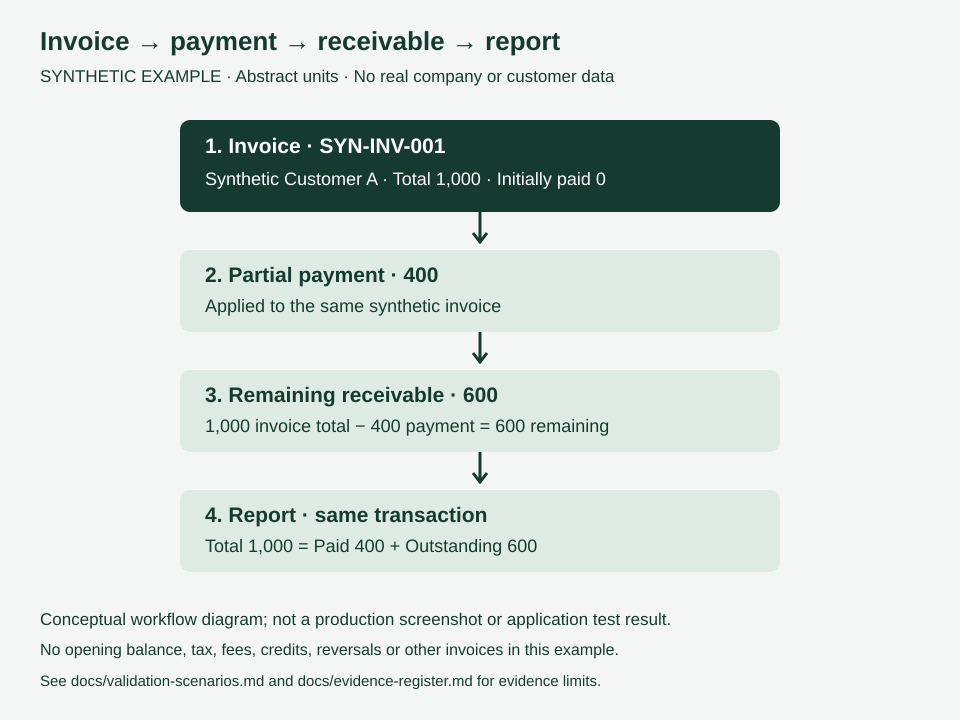

# Synthetic Validation Scenarios

**Evidence class: SYNTHETIC / ILLUSTRATIVE.** All identifiers and numbers below are invented. No live system was accessed and no production test was executed for this document.

## One Transaction Walkthrough

Assumptions: one invoice, no opening balance, tax, discount, fees, credits, refunds, reversals or other invoices. Amounts use abstract illustrative units, not a real currency or accounting policy. Labels below are documentation labels, not database fields or production status codes.

| Step | Synthetic input / event | Expected conceptual view |
|---|---|---|
| Invoice | `SYN-INV-001` for `Synthetic Customer A`, total 1,000 | Invoice total 1,000; paid 0; remaining 1,000 |
| Partial payment | Apply 400 to `SYN-INV-001` | Invoice total 1,000; paid 400; remaining 600 |
| Remaining receivable | Calculate 1,000 − 400 | Outstanding amount 600 for this invoice |
| Report | Show this single transaction | Total 1,000 = paid 400 + outstanding 600 |

Arithmetic check: `1,000 - 400 = 600`, and `400 + 600 = 1,000`. This checks the example's internal consistency only; it does not establish the private application's output.

## Proposed Failure-Path Checks — Not Executed Here

These checks extend the same synthetic scenario conceptually. They are review questions, not a claim of implemented handling or historical test passes.

| Check | Question / acceptance decision needed | Evidence status |
|---|---|---|
| Payment submitted twice | Is the second submission prevented or explicitly represented as a separate payment? It must not silently distort the balance. | Not verified |
| Payment exceeds balance | Is excess rejected, treated as credit, or handled through another defined policy? | Not verified |
| Payment correction or reversal | How does the outstanding amount and report change while preserving an explainable history? | Not verified |
| Missing or invalid amount | What validation and feedback are required before saving? | Not verified |
| Concurrent updates | Can two changes produce inconsistent paid/outstanding values? | Not verified |
| Report filters | Do report totals and invoice detail refer to the same included transaction set? | Not verified |

No reliability fixes or new executable tests are included. Verifying these questions later requires an authorized synthetic test environment and a known release, not an export from the live company database.
